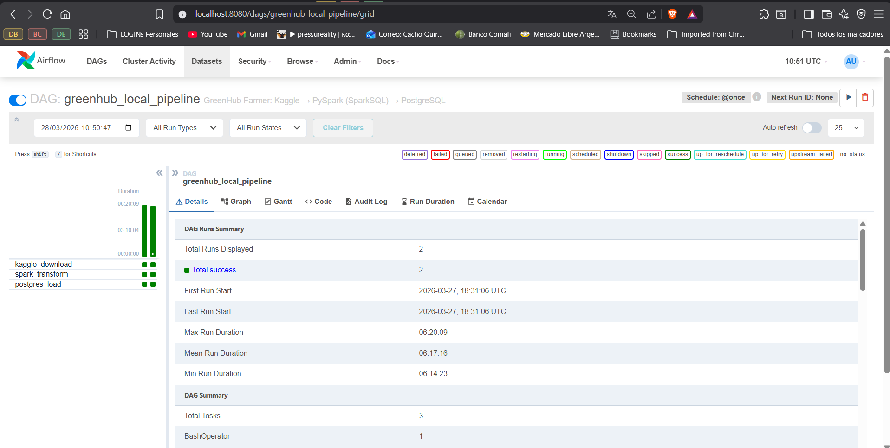
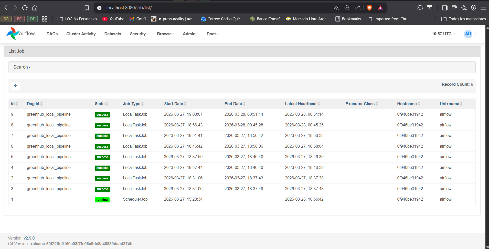

# GreenHub Farmer — Data Engineering Project

End-to-end data pipeline built as the final project for **Data Engineering Zoomcamp 2026** by DataTalks.Club.

---

## Problem Description

The [GreenHub Farmer](https://www.kaggle.com/datasets/hmatalonga/greenhub-farmer/data) dataset contains smartphone sensor measurements. It includes battery, CPU, RAM, network, and GPS data from multiple devices over time.

**Goal:** build a pipeline that processes this dataset (~3 GB) and exposes it in an interactive Dashboard with 2 visualizations, enabling efficient queries over millions of records.

### Dataset Provenance

> **Sources**
> The GreenHub Farmer dataset was established through the GreenHub initiative, a collaborative research effort involving several universities in Portugal and Brazil to study mobile energy consumption. The data is gathered via continuous crowdsourcing using an open-source mobile application called **BatteryHub**, which tracks system event broadcasts—such as battery state changes—to capture snapshots of a device's current state.
>
> **Collection Methodology**
> This collection methodology is designed to be anonymous, ensuring that no personal information, such as phone numbers or locations, is recorded. By leveraging institutional media outlets to attract users, the initiative successfully compiled a heterogeneous repository.
>
> **Citation**
> *GreenHub Farmer: Real-World Data for Android Energy Mining*

---

**Data model (star schema):**
```
devices (dimension)
    └── device_id ──► samples (fact)
                          ├── timestamp       → PARTITION BY
                          ├── battery_state   → CLUSTER BY / INDEX
                          ├── charger
                          ├── battery_level
                          ├── cpu_usage
                          └── memory_*
```

---

## Pipeline Architecture

```
Kaggle Dataset (.parquet ~3GB)
        │
        ▼
┌─────────────────────────────────────────────────────────────┐
│                    OPTION A — LOCAL                         │
│                                                             │
│  Airflow DAG  ──►  Spark SQL  ──►  PostgreSQL (Docker)      │
│  (orchestrate)    (transform)      (partitioned/indexed)    │
│                                           │                 │
│                                           ▼                 │
│                                    Looker Studio            │
└─────────────────────────────────────────────────────────────┘

┌─────────────────────────────────────────────────────────────┐
│                    OPTION B — CLOUD (GCP)                   │
│                                                             │
│  Local Parquet ──► GCS (BigLake) ──► BigQuery (CTAS)        │
│  (local upload)    (data lake)       (data warehouse)       │
│                    external table    PARTITION + CLUSTER     │
│                                           │                 │
│                                           ▼                 │
│                                    Looker Studio            │
└─────────────────────────────────────────────────────────────┘
        ▲
        │
   Terraform (IaC) provisions all GCP infrastructure
```

---

## Technologies Used

| Component | Technology |
|---|---|
| Language | Python 3.12 |
| Environment management | `uv` |
| Infrastructure as Code | Terraform |
| Containers | Docker + Docker Compose |
| Orchestration | Apache Airflow 2.9 |
| Local processing | Apache Spark (SparkSQL) |
| Local database | PostgreSQL 16 |
| Database UI | pgAdmin 4 |
| Data exploration | Jupyter Notebooks + DuckDB |
| Data Lake (cloud) | Google Cloud Storage (BigLake) |
| Data Warehouse (cloud) | BigQuery |
| Cloud processing | BigQuery CTAS (replaces Dataflow — see technical decision) |
| Dashboard | Looker Studio (+ Streamlit as bonus) |
| Version control | Git + GitHub |

---

## Project Structure

```
GreenHubFarmer/
│
├── terraform/                  # IaC — GCP infrastructure
│   ├── main.tf
│   ├── variables.tf
│   └── outputs.tf
│
├── docker/                     # Custom container Dockerfiles
│   └── airflow/
│       └── Dockerfile          # Airflow + PySpark + Kaggle CLI
│
├── docker-compose.yml          # Orchestrates the 4 containers
│
├── dags/                       # Airflow DAGs
│   ├── local_pipeline_dag.py   # Option A: Kaggle → Spark → PostgreSQL
│   └── gcp_pipeline_dag.py     # Option B: Local → GCS (BigLake) → BigQuery (CTAS)
│
├── scripts/                    # Auxiliary Python scripts
│
├── notebooks/                  # Exploration and development
│   └── 01_explore_dataset.ipynb
│
├── sql/                        # DDL for PostgreSQL and BigQuery
│
├── data/
│   ├── raw/                    # Downloaded data (git ignored)
│   └── processed/              # Transformed data (git ignored)
│
├── .env                        # Environment variables (git ignored)
├── .gitignore
├── .python-version             # Python 3.12
├── pyproject.toml              # Project dependencies (uv)
└── README.md
```

---

## Prerequisites

- Docker Desktop (running)
- Python 3.12+ with `uv` installed
- Terraform
- Kaggle account with API key configured at `~/.kaggle/kaggle.json`
- GCP account with a service account (`.json` file **not included in git**)

---

## Step 1 — Local Environment Setup

### ✅ Completed

The working environment was configured with Python 3.12 and the `uv` package manager.

### Files created

- `.python-version` → pins Python 3.12 for the project
- `pyproject.toml` → declares all project dependencies
- `.gitignore` → protects credentials, data, and Terraform state

### Project dependencies (`pyproject.toml`)

```toml
[dependencies]
pandas = ">=3.0.0"
pyarrow = ">=23.0.0"
duckdb = ">=1.2.0"
psycopg2-binary = ">=2.9.11"
sqlalchemy = ">=2.0.46"
google-cloud-storage = ">=2.19.0"
google-cloud-bigquery = ">=3.29.0"
kaggle = ">=1.7.4"
python-dotenv = ">=1.0.0"

[dev-dependencies]
jupyter = ">=1.1.1"
ipykernel = ">=6.29.0"
```

### Commands executed

```bash
uv venv              # creates the virtual environment in .venv/
uv sync --dev        # installs all dependencies (including dev)
```

**Technical decision:** `uv` is used for its fast dependency resolution and compatibility with the standard `pyproject.toml`. The environment is only used for notebooks and auxiliary scripts — Airflow and Spark run inside Docker.

---

## Step 2 — GitHub Sync

### ✅ Completed

The Git repository was initialized and pushed to GitHub.

### Commands executed

```bash
git init
git add .
git commit -m "chore: initial project structure with uv environment"
git remote add origin https://github.com/ayoquiroga/greenhub-farmer.git
git branch -M master
git pull origin master --allow-unrelated-histories  # GitHub creates README by default
git push -u origin master
```

### Issue resolved: `.gitignore` conflict

GitHub automatically generates a generic Python `.gitignore` when the repository is initialized. When attempting `git push`, there was a conflict with the project's custom `.gitignore`. It was resolved by overwriting the local file with the project version and making a new commit.

### `.gitignore` rules

```gitignore
# Virtual environment
.venv/

# Data (too large for git)
data/raw/
data/processed/
*.parquet
*.csv

# Credentials (NEVER in git)
*.json               # GCP service account key
!pyproject.toml      # exception: pyproject.toml IS included

# Terraform
*.tfstate
*.tfstate.backup
terraform.tfvars
```

---

## Step 3 — Dataset Exploration

### ✅ Completed

**Notebook:** [notebooks/01_explore_dataset.ipynb](notebooks/01_explore_dataset.ipynb)

### Exploration process

The notebook is organized into 7 sections:

| Section | Description |
|---|---|
| 0 | Kaggle credentials verification (`~/.kaggle/kaggle.json`) |
| 1 | Dataset download via Kaggle API |
| 2 | Parquet file listing with pandas |
| 3 | `DESCRIBE` and `COUNT(*)` with DuckDB (without loading everything into RAM) |
| 4 | Null analysis on a 50,000-row sample |
| 5 | Identifying columns for PARTITION and CLUSTER |
| 6 | CSV conversion via DuckDB `COPY` |
| 7 | Data schema conclusions |

### Dataset Structure (discovered)

| File | Role | Description |
|---|---|---|
| `samples.parquet` | **Fact table** | Sensor measurements per device and timestamp |
| `devices.parquet` | **Dimension table** | Static information for each device |

> **Note:** the Kaggle dataset comes already in Parquet format (not CSV as initially assumed). The notebook was adapted upon discovering this.

### Key findings

| Decision | Column | Justification |
|---|---|---|
| `PARTITION BY` | `timestamp` | Time series — reduces scan range for date queries |
| `CLUSTER BY` / `INDEX` | `battery_state` | 4 unique values: Charging/Discharging/Not charging/Full |
| Join key | `device_id` | Links `samples` → `devices` |

### `samples` columns for the Dashboard

```
timestamp        → datetime (PARTITION BY)
battery_state    → string   (CLUSTER BY / INDEX)
charger          → string   (3 values: unplugged, ac, usb)
battery_level    → float    (0-100%)
cpu_usage        → float    (% processor usage)
memory_free      → float    (MB free)
memory_used      → float    (MB in use)
network_type     → string   (WiFi, Mobile, None)
```

### Issues resolved

- DuckDB's `read_parquet()` does not support `SAMPLE_SIZE` (that parameter only exists in `read_csv_auto`). The parameter was removed and `LIMIT` was used instead.

---

## Step 4 — Docker Infrastructure

### ✅ Completed

### Files created

| File | Function |
|---|---|
| `docker-compose.yml` | Orchestrates the 5 services |
| `docker/airflow/Dockerfile` | Custom Airflow image with Java + PySpark |
| `docker/airflow/requirements.txt` | Additional Python dependencies for the container |
| `.env.example` | Environment variables template (in git) |
| `.env` | Real environment variables (in `.gitignore`) |

### Container architecture

```
docker-compose.yml
│
├── postgres (postgres:16)              port 5432
│   ├── tables: samples, devices
│   └── healthcheck: pg_isready
│
├── pgadmin (dpage/pgadmin4)            port 8085
│   └── depends_on: postgres (healthy)
│
├── airflow-metadata (postgres:16)      internal port
│   ├── Airflow internal metadata database
│   └── healthcheck: pg_isready
│
├── airflow-init (custom)               runs once
│   ├── airflow db init
│   ├── airflow users create
│   └── depends_on: airflow-metadata (healthy)
│
└── airflow (custom Dockerfile)         port 8080
    ├── FROM apache/airflow:2.9.0
    ├── Java 17 (required by PySpark)
    ├── RUN pip install pyspark kaggle pyarrow psycopg2-binary
    ├── volumes: dags/, data/, scripts/, logs/
    └── depends_on: airflow-metadata (healthy) + airflow-init (completed)
```

### Technical decisions

**Why 2 PostgreSQL instances?** Airflow requires its own database to store the state of DAGs, runs, and connections. It is completely independent from the project's database.

**Why Spark in `local[*]` mode inside Airflow?** For the local environment a separate Spark cluster is not needed. The `local[*]` mode uses all available CPU cores and simplifies the architecture by eliminating an extra container.

**Why `airflow-init` in a separate container?** Separating initialization from the server allows `airflow-init` to run only once (`restart: on-failure`) while the `airflow` container can restart if it fails. This is the recommended pattern from the official documentation.

**`uv` vs `pip` in Docker:** `uv` is used **only in the local environment** (notebooks and scripts). Inside Docker containers, `pip` is used directly because the official Airflow images are already optimized with pip.

### `.env` configuration

Before starting the containers, fill in the `.env`:

```bash
# 1. Generate a Fernet key for Airflow
uv run python -c "from cryptography.fernet import Fernet; print(Fernet.generate_key().decode())"

# 2. Copy the value to .env in AIRFLOW__CORE__FERNET_KEY

# 3. Fill in Kaggle credentials (see ~/.kaggle/kaggle.json)
#    KAGGLE_USERNAME and KAGGLE_KEY
```

### Commands to start the containers

```bash
# Create the logs folder mounted by Airflow
New-Item -ItemType Directory -Force -Path logs    # PowerShell
# mkdir -p logs                                   # bash/Linux/Mac

# Build the custom image and start all services
docker compose up -d
```

### Verification

| Service | URL | Credentials |
|---|---|---|
| Airflow | http://localhost:8080 | airflow / airflow |
| pgAdmin | http://localhost:8085 | admin@admin.com / root |
| PostgreSQL | localhost:5432 | postgres / postgres (DB: greenhub) |

**Connecting pgAdmin to PostgreSQL:**
- Host: `postgres` (service name in Docker Compose)
- Port: `5432`
- Database: `greenhub`
- Username / Password: as defined in `.env`

✅ Validated: Airflow web access, pgAdmin web, and PostgreSQL connection confirmed.

---

## Step 5 — Airflow DAG: Local Pipeline

### ✅ Completed

### File created

**`dags/local_pipeline_dag.py`** — automatically mounted in the Airflow container via Docker volume; Airflow detects it without needing a restart.

### DAG flow (`greenhub_local_pipeline`)

```
kaggle_download  ──►  spark_transform  ──►  postgres_load
  BashOperator        PythonOperator        PythonOperator
```

| Task | Operator | Description |
|---|---|---|
| `kaggle_download` | `BashOperator` | `kaggle datasets download -d hmatalonga/greenhub-farmer --unzip --force` |
| `spark_transform` | `PythonOperator` | PySpark in `local[*]` mode + **SparkSQL** to clean and enrich data |
| `postgres_load` | `PythonOperator` | Pandas loads processed Parquets into PostgreSQL, creates index |

### SparkSQL Transformations (Task 2)

```sql
SELECT
    CAST(timestamp AS TIMESTAMP)            AS timestamp,
    TO_DATE(CAST(timestamp AS TIMESTAMP))   AS date,
    YEAR(CAST(timestamp AS TIMESTAMP))      AS year,
    MONTH(CAST(timestamp AS TIMESTAMP))     AS month,
    HOUR(CAST(timestamp AS TIMESTAMP))      AS hour,
    device_id, battery_state, charger,
    battery_level, cpu_usage,
    memory_free, memory_used, network_type
FROM samples_raw
WHERE timestamp IS NOT NULL
  AND device_id  IS NOT NULL
```

Columns added: `date`, `year`, `month`, `hour` (keys for the dashboard).

### PostgreSQL Load (Task 3)

- **`devices`** → full replace on each run (small table)
- **`samples`** → replace + append per Parquet file (large table, reads one `part-file` at a time to avoid running out of RAM)
- **Index created:** `CREATE INDEX IF NOT EXISTS idx_samples_battery_ts ON samples (battery_state, timestamp)`

### `docker-compose.yml` update

PostgreSQL variables were added to the `x-airflow-common` block so the DAG can connect to the project database:

```yaml
POSTGRES_USER: ${POSTGRES_USER:-postgres}
POSTGRES_PASSWORD: ${POSTGRES_PASSWORD:-postgres}
POSTGRES_DB: ${POSTGRES_DB:-greenhub}
```

### How to trigger the DAG

```bash
# Restart containers to pick up new env vars
docker compose down && docker compose up -d

# Wait ~1 minute and activate the DAG in the Airflow UI
# → http://localhost:8080  → DAG: greenhub_local_pipeline → Toggle ON → Trigger DAG ▶
```

### Evidence of successful execution

**DAG Grid view** — all 3 tasks in green for both completed runs (max duration: 6h 20min, average: 6h 17min):



**Jobs list** — all `LocalTaskJob` with `success` status; last load finished at `2026-03-28 00:51:14 UTC` (~49M rows loaded into PostgreSQL):



**Real-time `postgres_load` log** — progress tracked file by file via `tail -f`:

```
$ docker exec greenhub-airflow bash -c \
  "tail -f '/opt/airflow/logs/dag_id=greenhub_local_pipeline/run_id=manual__2026-03-27T18:31:05.779561+00:00/task_id=postgres_load/attempt=1.log'" 2>&1

[2026-03-27T19:04:28.021+0000] INFO -   [1/22] →  2,112,699 rows loaded...
[2026-03-27T19:13:27.900+0000] INFO -   [2/22] →  4,225,398 rows loaded...
[2026-03-27T19:21:56.475+0000] INFO -   [3/22] →  6,338,097 rows loaded...
[2026-03-27T19:31:48.456+0000] INFO -   [4/22] →  8,450,796 rows loaded...
[2026-03-27T19:41:02.744+0000] INFO -   [5/22] → 10,563,495 rows loaded...
[2026-03-27T19:50:06.620+0000] INFO -   [6/22] → 12,676,194 rows loaded...
[2026-03-27T19:58:42.604+0000] INFO -   [7/22] → 14,788,893 rows loaded...
[2026-03-27T20:07:16.239+0000] INFO -   [8/22] → 16,901,592 rows loaded...
[2026-03-27T20:15:34.308+0000] INFO -   [9/22] → 19,014,291 rows loaded...
[2026-03-27T20:45:53.522+0000] INFO -  [12/22] → 25,352,388 rows loaded...
[2026-03-27T20:55:11.713+0000] INFO -  [13/22] → 27,465,087 rows loaded...
[2026-03-27T21:06:57.477+0000] INFO -  [14/22] → 29,577,786 rows loaded...
[2026-03-27T21:16:35.970+0000] INFO -  [15/22] → 31,690,485 rows loaded...
[2026-03-27T21:26:12.160+0000] INFO -  [16/22] → 33,803,189 rows loaded...
[2026-03-27T21:40:38.300+0000] INFO -  [17/22] → 36,620,121 rows loaded...
[2026-03-27T21:50:57.973+0000] INFO -  [18/22] → 39,437,053 rows loaded...
[2026-03-27T22:01:14.485+0000] INFO -  [19/22] → 42,253,985 rows loaded...
[2026-03-28T00:45:27.512+0000] INFO - ✓ Index created: (battery_state, timestamp)
[2026-03-28T00:45:27.516+0000] INFO - Done. Returned value was: None
[2026-03-28T00:45:27.541+0000] INFO - Marking task as SUCCESS. dag_id=greenhub_local_pipeline, task_id=postgres_load, start_date=20260327T185643, end_date=20260328T004527
[2026-03-28T00:45:27.717+0000] INFO - Task exited with return code 0
```

---

## Step 6 — Airflow DAG: Cloud Pipeline (GCP)

### ✅ Completed

**File:** `dags/gcp_pipeline_dag.py`

### Technical decision: BigLake + BigQuery CTAS instead of Dataflow

Dataflow (Apache Beam) was not enabled in the GCP project and its use would incur high processing costs. Since the data is already in Parquet format (which BigQuery reads natively), it was replaced by the following 3-step architecture:

| Step | Airflow Operator | Description |
|---|---|---|
| 1. Upload | `LocalFilesystemToGCSOperator` | Uploads 11 local Parquet files to GCS (1 devices + 10 samples) |
| 2. BigLake | `BigQueryCreateExternalTableOperator` | Creates external table over GCS → **Data Lake** (no data copy) |
| 3. BigQuery | `BigQueryInsertJobOperator` | `CREATE TABLE AS SELECT` from BigLake → **Data Warehouse** partitioned and clustered |

**Advantages over Dataflow:**
- BigQuery load jobs are **free** (no processing cost)
- Raw data lives **only once** in GCS; BigQuery only stores the materialized table
- Less infrastructure to manage (no need to enable the Dataflow API)
- Achieves the same goal: Data Lake separated from Data Warehouse with orchestrated transformation

**Data uploaded to GCS (cost optimization):**
- `devices/` → `part-0000.parquet` (1 file, full dimension table — 2.1M rows)
- `samples/` → `part-0000.parquet` to `part-0009.parquet` (10 files ≈ 21M rows)

**DAG flow:**
```
upload_to_gcs  ──►  create_biglake_table  ──►  load_to_bigquery
  (local→GCS)          (external table          (partitioned CTAS
  11 Parquets)           = Data Lake)             = Data Warehouse)
```

---

## Step 7 — Cloud Infrastructure with Terraform

### ✅ Completed

Resources created with Terraform in GCP project `kestra-sandbox-2026`:

- **Google Cloud Storage bucket** `greenhub-raw-kestra-2026` — Data Lake (region: `us-central1`, automatic deletion after 90 days)
- **BigQuery dataset** `greenhub` — Data Warehouse (region: `us-central1`)

```bash
cd terraform
terraform init   # downloads hashicorp/google v5.45.2
terraform plan   # preview: +2 to add
terraform apply  # type "yes" to confirm
```

**Apply output:**

```
google_bigquery_dataset.greenhub: Creation complete after 1s  [id=projects/kestra-sandbox-2026/datasets/greenhub]
google_storage_bucket.raw:       Creation complete after 2s  [id=greenhub-raw-kestra-2026]

Apply complete! Resources: 2 added, 0 changed, 0 destroyed.

Outputs:
  bq_dataset          = "greenhub"
  bq_dataset_location = "us-central1"
  bucket_name         = "greenhub-raw-kestra-2026"
  bucket_url          = "gs://greenhub-raw-kestra-2026"
```

**What does each command do?**

| Command | Description | Touches GCP |
|---|---|---|
| `terraform init` | Downloads the `hashicorp/google` provider and creates `.terraform.lock.hcl` with the exact version. Initializes the local backend (`terraform.tfstate`). | ❌ No |
| `terraform plan` | Shows a preview of resources to create/modify/destroy without applying anything. | ❌ No |
| `terraform apply` | Creates the actual GCP resources (GCS bucket + BigQuery dataset). Asks for confirmation before executing. | ✅ Yes |

---

## Step 8 — Data Warehouse: SQL Schema

### ✅ Completed

### PostgreSQL (local)

```sql
-- Table partitioned by timestamp range
-- Composite index on battery_state + timestamp
CREATE TABLE samples (
    timestamp       TIMESTAMPTZ NOT NULL,
    device_id       TEXT NOT NULL,
    battery_state   TEXT,
    charger         TEXT,
    battery_level   FLOAT,
    cpu_usage       FLOAT,
    memory_free     FLOAT,
    memory_used     FLOAT
) PARTITION BY RANGE (timestamp);

CREATE INDEX idx_battery_state ON samples (battery_state, timestamp);
```

### BigQuery (cloud)

```sql
CREATE TABLE `kestra-sandbox-2026.greenhub.samples`
PARTITION BY DATE(timestamp)
CLUSTER BY battery_state, charger;
```

### External Table (BigLake) vs Native Table

The pipeline implements the **Data Lake → Data Warehouse** pattern using both table types:

```
GCS (Parquet)
  └─► devices_external / samples_external   ← BigLake: cheap raw layer, always in sync with GCS
            └─► CTAS
                  └─► devices / samples     ← Native: analytics layer, fast, partitioned
```

| Feature | External Table (BigLake) | Native Table |
|---|---|---|
| Where data lives | GCS (Parquet in the bucket) | BigQuery internal storage (Capacitor) |
| Storage cost | Only pay GCS (~$0.02/GB/month) | ~$0.02/GB/month (similar) |
| Query speed | Slower — reads from GCS on every query | Much faster — columnized and compressed data |
| Partitioning / Clustering | ❌ Not available | ✅ Yes — reduces bytes scanned |
| DML (`INSERT`, `UPDATE`) | ❌ No | ✅ Yes |
| Typical use | Staging, data that changes at source | Dashboard, analytical queries |

**Why use both:** the external table is the cheap entry point, always in sync with GCS. The native table is an optimized copy on which dashboards are built — thanks to partitioning by `DATE(timestamp)` and clustering by `battery_state, charger`, BigQuery only scans the necessary partitions, reducing cost and latency.

---

## Step 9 — Transformations

### ✅ Completed

- **Local:** SparkSQL inside the Airflow DAG (`local[*]` mode)
- **Cloud:** BigQuery CTAS orchestrated by Airflow (GCS BigLake → native BigQuery)

---

## Step 10 — Dashboard

### ✅ Completed

**Tool:** Looker Studio

**2 required visualizations:**
1. Battery state distribution by charger type (stacked bar chart — categorical)
2. Average battery level evolution over time (line chart — temporal)

### Strategy: Pre-Aggregated Views vs Direct Connection

Looker Studio can connect to BigQuery in two ways. In this project we use **pre-aggregated views** to optimize speed and cost:

| | Direct connection to `samples` | Pre-aggregated view |
|---|---|---|
| What happens on each refresh | BigQuery scans ~21M rows + JOIN 2.1M rows | BigQuery reads only the already-grouped rows (dozens) |
| Speed | 2–5 seconds per tile | < 1 second |
| Cost per refresh | ~$0.005 | ~$0.0001 |
| Interactive filters | ✅ Any column | ✅ Only dimensions included in the view |
| When to use it | Tables < 1M rows or ad-hoc exploration | Dashboards with many visits and > 10M rows |

The views include the `date` column so Looker Studio can offer an **interactive date range filter** — visitors can narrow the time period they want to analyze without running queries against the full table.

**Views created in BigQuery:**

```sql
-- Tile 1: battery state distribution by charger and date
-- queries/views/v_battery_by_charger_daily.sql

-- Tile 2: daily average battery level evolution
-- queries/views/v_battery_level_daily.sql
```

### Looker Studio data sources

| Tile | BigQuery source | Chart type |
|---|---|---|
| Battery state by charger | `greenhub.v_battery_by_charger_daily` | Stacked bars (100%) |
| Battery level evolution | `greenhub.v_battery_level_daily` | Time series lines |

**Global filter:** `date` (date range) — applies to both tiles simultaneously.

### Public Dashboard

🔗 **[View dashboard in Looker Studio](https://lookerstudio.google.com/reporting/2bba7aae-c1ed-4d00-be9f-eea7044b93e8)**

**Bonus:** Streamlit as an open-source alternative

---

## Reproducibility: How to Run the Project

### Option A — Local

```bash
# 1. Clone the repository
git clone https://github.com/ayoquiroga/greenhub-farmer.git
cd greenhub-farmer

# 2. Configure environment variables
cp .env.example .env
# Edit .env with your Kaggle and PostgreSQL credentials

# 3. Start all containers
docker compose up -d

# 4. Access Airflow
# → http://localhost:8080  (user: airflow / pass: airflow)

# 5. Activate the "greenhub_local_pipeline" DAG

# 6. Verify data in pgAdmin
# → http://localhost:8085  (email: admin@admin.com / pass: root)
```

### Option B — Cloud (GCP)

```bash
# 1. Configure GCP credentials
export GOOGLE_APPLICATION_CREDENTIALS="path/to/service-account.json"

# 2. Provision infrastructure with Terraform
cd terraform
terraform init
terraform plan
terraform apply

# 3. Start Airflow
docker compose up -d

# 4. Activate the "greenhub_gcp_pipeline" DAG
```

---

## Project Evaluation (Course Criteria)

| Criterion | Status | Description |
|---|---|---|
| Problem description | ✅ | Dataset, goal, and data model documented |
| Cloud + IaC (Terraform) | ✅ | GCP with Terraform (BigQuery + GCS) |
| Batch ingestion (DAG) | ✅ | Airflow 2.9 + Docker Compose, DAG complete |
| Data Warehouse (partitioned) | ✅ | `PARTITION BY timestamp`, `CLUSTER BY battery_state` |
| Transformations | ✅ | SparkSQL (local) and BigQuery CTAS via BigLake (cloud) |
| Dashboard (2 tiles) | ✅ | [Looker Studio — 2 visualizations](https://lookerstudio.google.com/reporting/2bba7aae-c1ed-4d00-be9f-eea7044b93e8) |
| Reproducibility | ✅ | `docker compose up`, Terraform, instructions in README |

---

## Tips and Lessons Learned

### Docker

**`RUN` instruction: each one creates a read-only layer**

Each instruction in a Dockerfile (`FROM`, `RUN`, `COPY`, `ENV`, etc.) adds an immutable layer on top of the previous one. When running the container, Docker automatically adds a single **writable** layer on top of all read-only ones — everything the process writes there disappears when the container is removed (unless you use volumes).

```
┌─────────────────────────────┐  ← write layer (only at runtime, ephemeral)
├─────────────────────────────┤
│  RUN pip install ...        │  ← read-only
├─────────────────────────────┤
│  COPY requirements.txt ...  │  ← read-only
├─────────────────────────────┤
│  RUN apt-get install java   │  ← read-only
├─────────────────────────────┤
│  FROM apache/airflow:2.9.0  │  ← read-only (base image)
└─────────────────────────────┘
```

**Chain commands in a single `RUN` to keep the image compact**

If `apt-get clean` and `rm -rf /var/lib/apt/lists/*` were in separate `RUN` statements, the temporary files would be saved in the previous layer and the final image size would not be reduced. By doing everything in a single `RUN` with `&&`, the resulting layer no longer contains those files:

```dockerfile
# ✅ Correct — single layer, clean image
RUN apt-get update && \
    apt-get install -y --no-install-recommends openjdk-17-jdk-headless \
    && apt-get clean \
    && rm -rf /var/lib/apt/lists/*

# ❌ Incorrect — temporary files remain saved in the install layer
RUN apt-get update
RUN apt-get install -y openjdk-17-jdk-headless
RUN apt-get clean && rm -rf /var/lib/apt/lists/*
```

---

### Airflow

**`schedule_interval="@once"` is not a recurring schedule**

A DAG with `@once` runs **a single time** when activated for the first time or when a manual Trigger is launched. It does not run automatically on a recurring basis. To trigger it, go to the UI (http://localhost:8080) and click **▶ Trigger DAG**.

**`airflow tasks run` vs `airflow tasks test`**

- `airflow tasks run` requires connecting to the Airflow metadata database (internal DNS). If executed outside the scheduler context, it fails with a DNS resolution error.
- `airflow tasks test` runs the task directly **without writing to the metadata database**, making it useful for re-running a specific task without depending on the scheduler state.

```bash
# ✅ To re-run a task without touching the DAG state
airflow tasks test <dag_id> <task_id> '<execution_date>'
```

---

### Python dependency compatibility in Airflow 2.9

Airflow 2.9 internally uses **SQLAlchemy 1.4.x**, which imposes cascading restrictions:

| Package | Correct version | Reason |
|---|---|---|
| `pandas` | `==2.1.4` | pandas 3.x requires SQLAlchemy 2.x (incompatible). `apache-airflow-providers-google` requires `pandas<2.2` |
| `kaggle` | `==1.6.17` | `1.7.x` has a `FileExistsError` bug on import, and a protobuf error (`DatasetInfo has no "info" field`) |
| `pyarrow` | `>=23.0.0` | Required for `iter_batches()` in Parquet loading |

---

### Loading large datasets into PostgreSQL — avoiding OOM

Loading full Parquet files (~700K rows × 42 columns) into a pandas DataFrame before inserting them generates memory spikes that end in SIGKILL (exit code -9). The solution is to use micro-batches with PyArrow:

```python
# ❌ Causes OOM with large files
df = pd.read_parquet(part_file)
df.to_sql("samples", engine, if_exists="append")

# ✅ Micro-batches of 50K rows: constant memory
import pyarrow.parquet as pq
import gc

pf = pq.ParquetFile(part_file)
for batch in pf.iter_batches(batch_size=50_000):
    batch_df = batch.to_pandas()
    batch_df.to_sql("samples", engine, if_exists="append", chunksize=5000)
    del batch_df
    gc.collect()
```

**Monitor loading progress from the terminal**

The `postgres_load` task can take hours (22 files × ~2.1M rows each ≈ 49M total rows). To see in real time how many files and rows have been loaded, follow the Airflow log with `tail -f`:

```bash
docker exec greenhub-airflow bash -c \
  "tail -f '/opt/airflow/logs/dag_id=greenhub_local_pipeline/run_id=manual__<EXECUTION_DATE>/task_id=postgres_load/attempt=1.log'" \
  2>&1
```

> Replace `<EXECUTION_DATE>` with the real `run_id`. If you don't have it from the Airflow UI, you can list it directly from the terminal:
>
> ```bash
> docker exec greenhub-airflow bash -c "ls -lh '/opt/airflow/logs/dag_id=greenhub_local_pipeline/'" 2>&1
> ```
>
> Example output:
>
> ```
> /opt/airflow/logs/dag_id=greenhub_local_pipeline/:
> run_id=manual__2026-03-27T18:31:05.779561+00:00
> run_id=scheduled__2026-01-01T00:00:00+00:00
> ```
>
> Use the `run_id` with the most recent timestamp (the `manual__...` one if triggered manually).

Expected output example (one line approximately every ~9 minutes):

```
[2026-03-27T19:04:28.021+0000] {logging_mixin.py:188} INFO -   [1/22] → 2,112,699 rows loaded...
[2026-03-27T19:13:27.900+0000] {logging_mixin.py:188} INFO -   [2/22] → 4,225,398 rows loaded...
[2026-03-27T19:21:56.475+0000] {logging_mixin.py:188} INFO -   [3/22] → 6,338,097 rows loaded...
[2026-03-27T19:31:48.456+0000] {logging_mixin.py:188} INFO -   [4/22] → 8,450,796 rows loaded...
[2026-03-27T19:41:02.744+0000] {logging_mixin.py:188} INFO -   [5/22] → 10,563,495 rows loaded...
[2026-03-27T19:50:06.620+0000] {logging_mixin.py:188} INFO -   [6/22] → 12,676,194 rows loaded...
[2026-03-27T19:58:42.604+0000] {logging_mixin.py:188} INFO -   [7/22] → 14,788,893 rows loaded...
[2026-03-27T20:07:16.239+0000] {logging_mixin.py:188} INFO -   [8/22] → 16,901,592 rows loaded...
[2026-03-27T20:15:34.308+0000] {logging_mixin.py:188} INFO -   [9/22] → 19,014,291 rows loaded...
[2026-03-27T20:24:53.130+0000] {logging_mixin.py:188} INFO -  [10/22] → 21,126,990 rows loaded...
[2026-03-27T20:36:21.427+0000] {logging_mixin.py:188} INFO -  [11/22] → 23,239,689 rows loaded...
```
